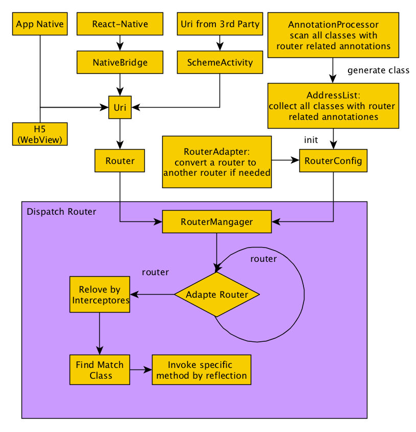

# README
## 泰然APP路由架构参考

## 功能简介
1. 支持1对多的URI匹配，URL匹配采用startWith匹配方式，支持在多个匹配中筛选最佳匹配
2. 支持配置全局和局部拦截器，支持拦截器内的同步和异步操作，例如登录判断、实名认证判断等，减少重复代码
3. 支持配置全局和局部降级策略，当没有找到匹配的URI处理类时，可以配置默认方案
4. 相对于最近美团开源的1.0.41版本，我们的API更简洁易用，我们的源码也更简单易改，即适合学习，又方便改造

## 适用场景
1. 混合开发模式(Native + ReactNative + H5 + Flutter 等)，需要进行页面之间的互相跳转，或进行灵活的运营跳转链接下发。可以利用Router统一页面跳转逻辑。
2. 页面跳转需要很多前置的条件判断，这些条件判断可能有异步的处理。例如在金融类APP里面常常会根据用户的授信状态决定是否能进入相关页面，而守信状态又是要实时查询的异步操作，使用Router框架可以通过在相关的页面上声明一个授信状态校验的拦截器即可。其他常见的如登录状态拦截器、全局的页面跳转日志拦截器等各种认证状态拦截器。
3. 组件化开发。多个模块的代码尽量减少依赖，通过Router可以解耦代码依赖，例如不需要构造Intent时产生的代码依赖，API请求也可以通过Router进行代理处理。
4. 页面动态切换。可以通过配置RouterAdapter，实现后台对路由表的配置。


## 依赖配置
### 工程（项目根目录）build.gradle文件配置

```
ext {
    routerVersionName = '1.0.0'//该变量名和项目里面gradle里面文件名相对应
}
```
Module模块build.gradle文件配置

```
dependencies {
    annotationProcessor 'com.trc.android:lib-router-processor:' + rootProject.ext.routerVersionName   //每个需要扫描注解的模块都需要
	api 'com.trc.android:lib-router:' + rootProject.ext.routerVersion//最好放在base模块里面
}
```
App模块build.gradle的android闭包内添加如下配置(需要支持lambda表达式)

```
compileOptions {
    sourceCompatibility JavaVersion.VERSION_1_8
    targetCompatibility JavaVersion.VERSION_1_8
}
```

## 简单使用

#### 示例代码1:声明在Activity上

```
@RouterUri("demo://to_login")
public class LoginActivity extends Activity {
	public static void start(Router router){//需要处理参数，则需要提供该方法完成参数处理及页面跳转
		//router对应的uri为：demo://to_login?channelCode=official
    	Context context = router.getContext();
		String channel = router.getParams("channelCode");//去除uri中的参数
		Intent intent = new Intent(context, LoginActivity.class);
		intent.put(LoginActivity.INTENT_KEY_CHANNEL, channel);
    	context.startActivity(intent);
 	}
}


//启动该Activity一行代码完成
Router.from(context).to("demo://to_login)
```

#### 示例代码2:声明在任意Class上

```
注意Callback的相关处理

@RouterUri({"scheme_old://share","scheme_new://share"})//声明的URI可以包含多个
public class ShareUriHandler{
	
	//路由管理器最终会调用该方法。如果是Activity的无参数跳转，那么该Activity可以省略此方法
	public static void start(Router router){
    	Context context = router.getContext();
    	ShareApi.share(context, router.toUri(), new ShareCallback() {
       		@Override
        	public void onShareEvent(ShareEvent shareEvent) {
        		Router.Callback callback = router.getCallback();
            	if (null != callback) {//如果Router有设置Callback，需要处理回调结果
            		Bundle bundle = new Bundle();
            		bundle.putSerializable(SHARE_EVENT, shareEvent);
                	callback.onResult(true, bundle);
        		}
    		});
		}
 	}
}


public class SomeActivity	{
	...
	...
	public void onClickShare(View v) {
		//通过Router唤起分享功能
		Router.from(this).to("scheme_old://share?title=%e5%88%86%e4%ba%ab%e6%9c%89%e7%a4%bc&link=http%3a%2f%2fwww.baidu.com");
		
		//或者通过如下方式
		Router.from(this)
			.setParam("title","分享有礼")
			.setParam("link","http://www.baidu.com")
			.toUri("scheme_old://share");
			
		//如果需要获取分享结果
		Router.Callback callback = new Router.Callback() {
            @Override
            public void onResult(boolean succeed, Map map) {
                if(succeed){
                		//Do something
                }
            }
        };
		Router.from(this)
			.setCallback(callback)
			.setParam("title","分享有礼")
			.setParam("link","http://www.baidu.com")
			.toUri("scheme_old://share");
	}
	...
	...
}

```

#### 示例代码3:跳转第三方Activity页面时（比如跳转第三方FaceIdActivity，FaceIdActivity无法编辑）

```
@RouterUri("third_party_uri")
public class FaceIdUriHandler {
    //配置当前类的注解实现Router路由
    public static void start(Router router) {
        String bundleName = router.getParams("module");
        String page = router.getParams("page");
        Bundle bundle = new Bundle();
        bundle.putString("page", page);
        router.getContext().startActivity(FaceIdActivity y.newIntent(router.getContext(), bundleName, bundle));
    }
}

//一行代码跳转第三方Activity
Router.fromCurrent().setParam("page",1).setParam("module","main).to("third_party_uri");
```

## 配置及初始化
在主模块（APP模块）的任意一个类上添加注解如下：
编译扫描到该注解会确定当前编译的模块是最后一个模块(App模块)，进而在该模块编译结束后生成AddressList.class

```
@RouterAppModule
public class MainActivity extends Activity {  }
```

初始化Router
主模块新建RouterHelper类，代码如下

```
public class RouterHelper {
    public static HashMap<String, String> redirectMap = new HashMap<>();
    public static RedirectAdapter redirectAdapter = new RedirectAdapter() {
    @Override
 	public Router adapt(Router router) {//该路由转换的实现方案是基于当前APP路由管理后台的方案实现的，如果没有，直接return router;
            String url = router.toUriStr();
            for (String targetUrl : redirectMap.keySet()) {
                if (url.contains(targetUrl)) {
                    return Router.from(router.getContext()).setUri(redirectMap.get(targetUrl));
                }
            }
            return router;
        }
    };

    public static void init(Application application) {
        RouterConfig.getInstance()
                .init(application)
				.addInterceptor(LogInterceptor.class)//路由管理器在处理路由时，会传递给该拦截器进行拦截处理,比如添加一个记录页面跳转的拦截器，该拦截器优先级最高
 				.setRedirectAdapter(redirectAdapter);//路由管理器在处理路由时，会首先使用RedirectAdapter进行路由转换，一般用作后台对路由的配置
    	}
}
```

路由跳转
>示例代码1：
>
```
//直接跳转到登录页面
Router.from(MainActivity.this).to("demo://login");
...
//效果同上，直接跳转到登录页面
Router.from(MainActivity.this).setUri("demo://login").go();
...
//如果当前代码前后文不方便获取Context的时候，该方法会优先使用当前Activity，如果没有则使用Application
Router.fromCurrentContext().to("demo://login");
...
```

>示例代码2
>
```
代码对1:通过router获取一个对象，该对象可以是一个Framgnet，也可以是一个包含了业务逻辑的View组合，也可以是其他任何对象，最终的返回结果由对应Class(该例子中下面的RemoteViewDemo)的public static RemoteViewDemo transformObject(Router router) 的实现决定
public class SomeClass{
	public void someMethod() {
		//通过URI获取一个对象，该URI匹配的Class必须提供public static RemoteViewDemo transformObject(Router router)方法
		View v = (View) Router.from(this).setUri("demo://custom_view").transform();
	}
}
...
...
...
代码对2:
@RouterUri("demo://custom_view")
public class RemoteViewDemo extends TextView {
    public RemoteViewDemo(Context context) {
        super(context);
        setText("This view can be declared in other module so that we can cut off the dependency of codding level");
    }
    //必须实现此方法，返回类型可为任意类型
    public static View transformObject(Router router) {
        return new RemoteViewDemo(router.getContext());
    }
}
```

>示例代码3：Router中的URI参数设置及传递
>
```
router.setParams(String key, Object value)设置Query参数,去参数是对应 
router.getParams(String key)方法，该方法只适合传递基本类型的数据
Router.form(context).setParams("goodsId", "2C8DS").setParams("goodsCategory", 1).to("demo://goodsDetail") 
Router.form(context).to("demo://goodsDetail?goodsId=2C8DS&goodsCategory=1") //效果同上，建议使用上一种方式传参
```


>示例代码：Router参数设置及传递
>
```
put(String key, Object value), get(String key)对象参数传递，该参数存放在Router的一个Map里面，主要传递一些诸如Model、Fragment、WebView等对象
比如上面提到的ShareRouterHandler，来处理分享URI的Handler，如果是从WebView分发过来的，不要带上WebView对象，这样在分享成功后，可以拿到WebView对象，调相应的JS方法把分享结果告诉H5示例代码7:设置回调，可以获取跳转后的页面的异步回调结果
Router.from(this).setCallback(new Router.Callback() {
 	@Override public void onResult(boolean succeed, Map map) {
 		Toast.makeText(MainActivity.this, ""+map.get("name"), Toast.LENGTH_SHORT).show();
 	}
}).to("tlkj://trc.com");
```

## 拦截器配置
就是在跳转到指定页面的时候(准确的说是在执行URI匹配的class的start方式之前)，需要做拦截操作，诸如登录校验、实名认证校验等常用校验操作可使用拦截器做到代码复用、简化的目的。

示例拦截器-登录拦截器

```
public class LoginInterceptor implements Interceptor {
    @Override   
    public void handle(Router router, Chain chain) { 
           if (!UserConfig.isLogined())    //如果未登录则跳转到登录，回来之后检查登录结果，如果登录成功则继续路由下去，否则停止路由     
                 Router.Callback loginCallback = new Router.Callback() {
    				@Override
    				public void onResult(boolean succeed, Bundle bundle) {
        				if (succeed) {
            				chain.proceed(router);//此行代码保证路由能继续被处理，否则路由分发就此终止
        				}else {
            				Toast.makeText(router.getContext(), "登录失败", Toast.LENGTH_SHORT).show();
        				}
    				}
    			}
    			Router.from(router.getContext()).setCallback(loginCallback).to(Pages.LOGIN);         
           else {         
                chain.proceed(router); //此行代码保证路由能继续被处理，否则路由分发就此终止
           }  
     } 
} 
```

示例拦截器-实名认证拦截器

```
public class RealNameOauthInterceptor implements Interceptor {
    @Override   
    public void handle(Router router, Chain chain) {    
			RealNameApi.getRealNameStatus(new Callback<Boolean>(){
				public void onSuccess(Boolean isRealName){
					if (isRealName)//未登录则跳转到登录页面
						Router.Callback realNameCallback = new Router.Callback() {
    						@Override
    						public void onResult(boolean succeed, Bundle bundle) {
        						if (succeed) {//认证成功，继续执行之前到路由
            						chain.proceed(router);//此行代码保证路由能继续被处理，否则路由分发就此终止
        						}else {//认证失败，放弃路由
            						Toast.makeText(router.getContext(), "登录失败", Toast.LENGTH_SHORT).show();
        						}
    						}          
                 		Router.from(router.getContext()).setCallback(realNameCallback).to("demo://realname_oauth");//跳转到实名认证页面进行认证       
           			else {         
                 		chain.proceed(router); //此行代码保证路由能继续被处理，否则路由分发就此终止
					}
			});
		   
     } 
} 
```

全局拦截器配置（最高优先级）

```
//路由管理器在初始化时候配置，例如打印页面跳转的拦截器
RouterConfig.getInstance().addInterceptor(LogInterceptor.class)
2跳转前配置拦截器配置（次高优先级）
//拦截器也可以在路由跳转配置时设置，例如跳转到充值页面前先要检查是否绑卡
Router.from(context).setInterceptor(BindBankCardInterceptor.class).to("demo://recharge")
```
 
注解拦截器配置 (最低优先级)

```
//比如，想进入充值页面（demo://recharge）页面,首先想到要进行登录检查，然后再进行实名状态检查
@RouterUri("demo://recharge")
@RouterInterceptor({LoginInterceptor.class, RealNameOauthInterceptor.class})//跳转到该页面前先要通过登录拦截器和实名认证拦截器
public class RechargeActivity extends Activity {
...
...
}
```

## 混淆配置

```
#Router -end
 -keepattributes *Annotation*
 -keep public class com.trc.android.router.build.**{*;}
 -keeppackagenames com.trc.android.router.annotation.**
 -keep @com.trc.android.router.annotation.** class *
 -keepclassmembers class * {
     public static void start(com.trc.android.router.Router);
 }
 -keepclassmembers class * {
     public static RemoteViewDemo transformObject(com.trc.android.router.Router);
 }
 #Router -end
```